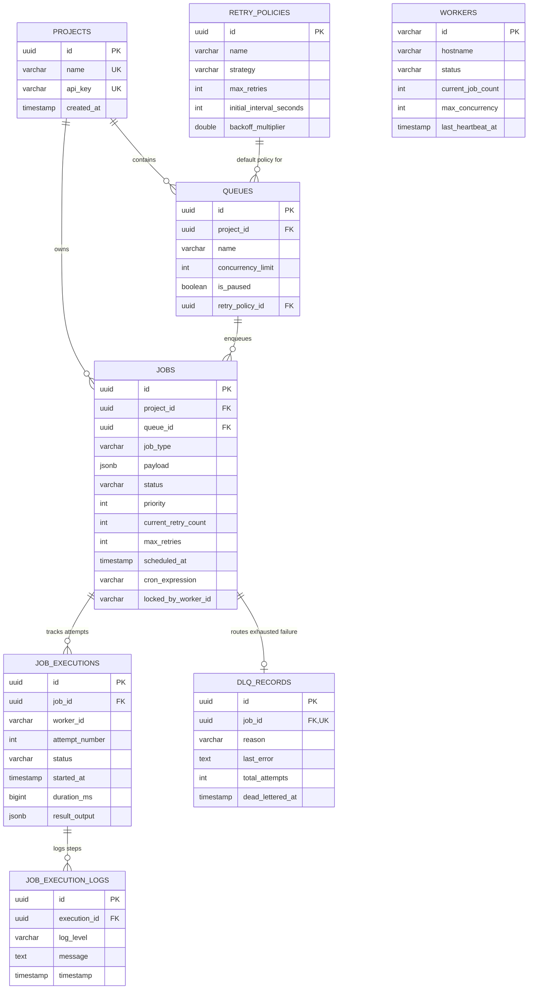
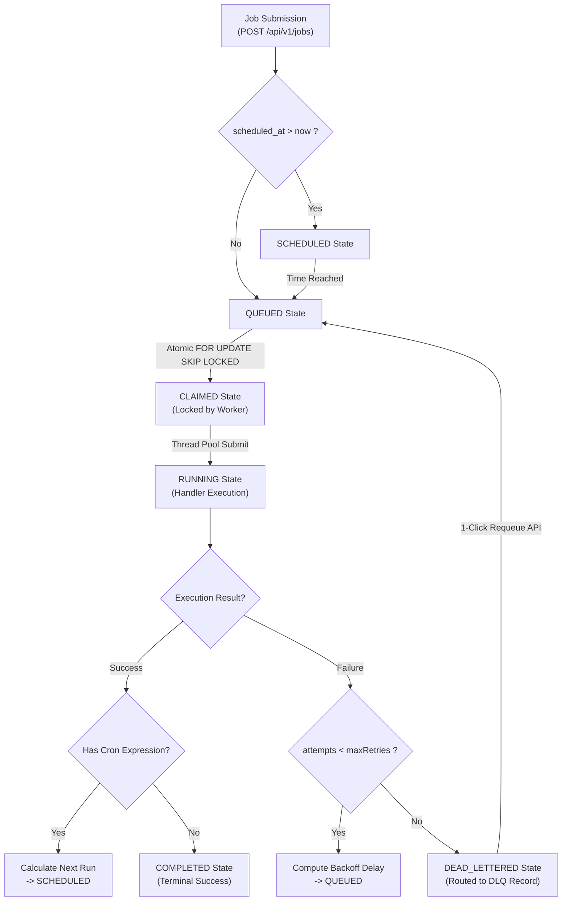

# Distributed Job Scheduler
## Technical Design and Implementation Report

**Student Name:** Kaviya M  
**Register Number:** 127156074  
**Department:** B.E. Computer Science and Engineering (Specialisation in Artificial Intelligence and Data Science)  
**GitHub Repository:** [https://github.com/kaviyah346/distributed-job-scheduler](https://github.com/kaviyah346/distributed-job-scheduler)  
**Stack:** Java 21 / Spring Boot 3.3.4 / PostgreSQL / Keycloak 24 / Next.js 14 / Docker Compose / TailwindCSS  

---

### 1. Executive Summary

Modern enterprise software systems increasingly depend on decoupled, asynchronous execution pipelines to handle long-running computations, third-party integrations, recurring maintenance jobs, and batch workflows without blocking synchronous web request cycles. Building a robust distributed scheduler requires solving core engineering challenges in database concurrency, worker race conditions, distributed consensus, fault recovery, and strict execution observability.

The **Distributed Job Scheduler** is a production-grade, distributed background job scheduling platform built as a modular monolith in **Java 21 / Spring Boot 3.3.4** with a high-concurrency **PostgreSQL** transactional persistence engine, secured by **Keycloak OIDC / OAuth2 JWT Bearer Tokens**, and managed via a **Next.js 14** real-time control console.

#### Main Purpose & Solved Problems:
- **Zero Duplicate Execution under High Concurrency:** Eliminates distributed worker race conditions using atomic PostgreSQL row-level locks via `FOR UPDATE SKIP LOCKED` combined with state machine validations.
- **Queue-Level Concurrency & Priority Scheduling:** Dynamically enforces per-queue concurrency limits and pauses dispatch without halting workers, scheduling tasks by strict integer priority and schedule time.
- **Resilient Execution & Dynamic Backoff:** Provides configurable retry policies (Fixed, Linear, Exponential Backoff) that automatically route exhausted failures to a dedicated Dead Letter Queue (DLQ) with full stack trace capture and 1-click re-queue recovery.
- **Worker Liveness & Stale Worker Recovery:** Employs scheduled heartbeat monitoring to detect dead/crashed worker nodes and automatically rescues orphaned jobs back into the retry/DLQ pipeline.
- **Fine-Grained Observability:** Persists individual attempt durations, worker identities, JSON result outputs, and line-by-line structured logs viewable via an interactive terminal log drawer.

---

### 2. Project Objectives and Assignment Alignment

| Assignment Requirement | Implementation Status | Evidence from Project | Implementation Details |
| :--- | :---: | :--- | :--- |
| **Modular Backend Architecture** | **IMPLEMENTED** | `backend/src/main/java/com/distributed/scheduler` | Packaged by domain: `job`, `queue`, `execution`, `retry`, `dlq`, `worker`, `scheduler`, `project`, `security`. |
| **Atomic Job Claiming** | **IMPLEMENTED** | `JobRepository.claimEligibleJobs()` | Native SQL with `FOR UPDATE OF j SKIP LOCKED` + CTE + `RETURNING *` in a single atomic transaction. |
| **Queue Concurrency & Pause/Resume** | **IMPLEMENTED** | `QueueEntity.java`, `QueueService.java` | Native query enforces `q.is_paused = FALSE` and dynamic subquery checking active running job count limits. |
| **Immediate & Delayed Scheduling** | **IMPLEMENTED** | `JobService.createJob()`, `ScheduledJobEligibilityService.java` | Future timestamps set status to `SCHEDULED`; background engine promotes due jobs to `QUEUED`. |
| **Recurring Cron Jobs** | **IMPLEMENTED** | `CronSchedulingService.java` | Parses standard 5-field & 6-field cron expressions via Spring's `CronExpression`, auto-calculates next run, and re-schedules. |
| **Configurable Retry Backoff** | **IMPLEMENTED** | `RetryService.java`, `BackoffCalculator.java` | Supports `FIXED`, `LINEAR_BACKOFF`, and `EXPONENTIAL_BACKOFF` with configurable max retries, initial intervals, multipliers, and caps. |
| **Dead Letter Queue (DLQ) & Recovery** | **IMPLEMENTED** | `DlqRecordEntity.java`, `DlqService.java` | Moves exhausted jobs to `DEAD_LETTERED`, records reason & stack trace; provides 1-click re-queue and purge. |
| **Worker Heartbeats & Recovery** | **IMPLEMENTED** | `WorkerRegistrationService.java`, `StaleWorkerRecoveryService.java` | Workers send 5s heartbeats; recovery service flags silent workers as `DEAD` after 60s timeout and recovers orphaned jobs. |
| **Execution Logging & Audit** | **IMPLEMENTED** | `JobExecutionEntity.java`, `JobExecutionLogEntity.java` | Records each attempt, start/complete timestamps, execution duration in ms, JSON output payload, and structured logs. |
| **Authentication & RBAC** | **IMPLEMENTED** | `SecurityConfig.java`, `JwtAuthConverter.java` | Keycloak OIDC integration with JWT validation, custom converter extracting realm/client roles (`ADMIN`, `DEVELOPER`, `OPERATOR`). |
| **Interactive Management UI** | **IMPLEMENTED** | `frontend/src/app` | Next.js 14 frontend featuring Dashboard, Projects & Queues Manager, Jobs Explorer, Retry Policies Studio, DLQ Hub, and Terminal Logs Modal. |
| **Automated Tests** | **IMPLEMENTED** | `DistributedJobSchedulerApplicationTests.java`, `SecurityIntegrationTests.java` | 16 comprehensive integration tests covering full lifecycle, concurrency batches, retries, cron re-queuing, pause/resume, DLQ, and JWT RBAC. |

---

### 3. Technology Stack

| Technology | Version / Specification | Purpose in this Project |
| :--- | :--- | :--- |
| **Java** | `21` (LTS) | Core backend programming language utilizing modern switch expressions, records, and virtual-thread compatibility. |
| **Spring Boot** | `3.3.4` | Application framework providing dependency injection, embedded Tomcat, configuration management, and lifecycle hooks. |
| **Spring Data JPA / Hibernate** | `6.5` / `3.3.4` | ORM abstraction layer for relational database operations, schema updates, and native query mapping. |
| **PostgreSQL** | `15+` compatible | Primary ACID relational database and distributed queue storage engine supporting `FOR UPDATE SKIP LOCKED` and `jsonb`. |
| **Hypersistence Utils** | `3.8.2` | Hibernate 6.3+ JSON type mapping integration for mapping Java `Map<String, Object>` payloads directly to PostgreSQL `jsonb` columns. |
| **Spring Security & OAuth2 Resource Server** | `6.3.3` | Enforces stateless Bearer JWT token verification, CORS filtering, endpoint authorization, and principal mapping. |
| **Keycloak** | `24.0.5` | Open-source OpenID Connect (OIDC) Identity and Access Management server managing realms, clients, users, and roles. |
| **SpringDoc OpenAPI / Swagger UI** | `2.6.0` | Generates OpenAPI 3.0 metadata and provides interactive in-browser Swagger UI on `/swagger-ui/index.html`. |
| **Next.js** | `14.2.14` | React 18 frontend framework using App Router, TypeScript, and client-side Keycloak SDK integration. |
| **TailwindCSS** | `3.4.13` | Utility-first styling framework implementing dark-mode glassmorphism, responsive grid layouts, and custom typography. |
| **JUnit 5 / AssertJ / MockMvc** | `5.10.3` | Testing suite for end-to-end asynchronous lifecycle flows, concurrency verification, and security authorization tests. |
| **Docker & Docker Compose** | `Compose v2` | Containerized setup for local Keycloak authentication realm deployment and backend container packaging. |

---

### 4. System Architecture

The platform follows a decoupled modular monolith architecture where PostgreSQL coordinates atomic job dispatch across background worker threads without external message broker overhead.

```
+---------------------------------------------------------------------------------------------------------------+
|                                            Clients & Frontend                                                 |
|               +----------------------------+                     +----------------------------+               |
|               |   Web Dashboard (Next.js)  |                     |  Swagger UI (OpenAPI 3.0)  |               |
|               +----------------------------+                     +----------------------------+               |
|                                                     HTTPS / REST / JSON                                       |
+---------------------------------------------------------------------------------------------------------------+
                                                       |
+---------------------------------------------------------------------------------------------------------------+  +--------------------------+
|                                  Backend - Modular Monolith (Spring Boot 3.3.4)                               |  |   External Integrations  |
|                                                                                                               |  |                          |
|  +--------------------+  +----------------------+  +---------------------+  +-----------------+  +----------+ |  |  +--------------------+  |
|  | Security & Access  |  | Interface Adapters   |  | Application Services|  | Cross-Cutting   |  | Config   | |  |  | Email / SMTP       |  |
|  |                    |  | (Controllers)        |  |                     |  | Services        |  |          | |  |  | (Notifications)   |  |
|  | Keycloak (OIDC)    |  | - Auth Controller    |  | - Job Mgmt Service  |  | - Logging/Audit |  | -Security| |  |  +--------------------+  |
|  | Authentication     |  | - Queue Controller   |  | - Scheduling Service|  | - Security Svc  |  | -JWT/OAt | |  |  +--------------------+  |
|  | & Authorization    |  | - Job Controller     |  | - Concurrency Svc   |  | - Validation    |  | -CORS    | |  |  | Webhooks (Future)  |  |
|  |                    |  | - Execution Ctrl     |  | - Retry & Backoff   |  | - Exceptions    |  | -Swagger | |  |  +--------------------+  |
|  |                    |  | - Worker Controller  |  | - Notification Svc  |  | - Metrics       |  |          | |  |  +--------------------+  |
|  +--------------------+  +----------------------+  +---------------------+  +-----------------+  +----------+ |  |  | Cloud Storage(Fut) |  |
|                                                                                                               |  |  +--------------------+  |
|  +---------------------------------------------------------------------------------------------------------+ |  +--------------------------+
|  |                                  Data Access Layer (Repositories)                                        | |
|  |  JobRepository | QueueRepository | ExecutionRepository | DLQRepository | WorkerRepository | UserRepository | |
|  +---------------------------------------------------------------------------------------------------------+ |
|                                                                                                               |
|  +---------------------------------------------------------------------------------------------------------+ |
|  |                              PostgreSQL 15+ (ACID Compliant Persistence)                                 | |
|  |   job (Jobs)  |  queue (Queues)  |  execution  |  retry_policy  |  dlq (DLQ)  |  worker  |  worker_hb     | |
|  +---------------------------------------------------------------------------------------------------------+ |
|                                                                                                               |
|  +------------------------------------------------------+   +----------------------------------------------+ |
|  | Background Workers (Multi-threaded FixedThreadPool)  |   | Observability & Monitoring                   | |
|  | Worker 1  |  Worker 2  |  ......  |  Worker N        |   | Structured Logs | Metrics | Health | Audit   | |
|  +------------------------------------------------------+   +----------------------------------------------+ |
+---------------------------------------------------------------------------------------------------------------+
```

---

### 5. Database Design & ER Diagram



---

### 6. Job Lifecycle and Scheduling Flow



---

### 7. Reliability and Concurrency

```sql
WITH eligible_jobs AS (
    SELECT j.id
    FROM jobs j
    JOIN queues q ON j.queue_id = q.id
    WHERE j.status = 'QUEUED'
      AND j.scheduled_at <= CURRENT_TIMESTAMP
      AND q.is_paused = FALSE
      AND (
          SELECT COUNT(*)
          FROM jobs r
          WHERE r.queue_id = q.id AND r.status = 'RUNNING'
      ) < q.concurrency_limit
    ORDER BY j.priority DESC, j.scheduled_at ASC, j.created_at ASC
    FOR UPDATE OF j SKIP LOCKED
    LIMIT :batchSize
)
UPDATE jobs
SET status = 'CLAIMED',
    locked_by_worker_id = :workerId,
    locked_at = CURRENT_TIMESTAMP,
    updated_at = CURRENT_TIMESTAMP
WHERE id IN (SELECT id FROM eligible_jobs)
RETURNING *
```

- **`FOR UPDATE OF j SKIP LOCKED`:** Guarantees zero duplicate job execution and avoids worker blocking.
- **Queue Concurrency Enforcement:** Enforces `q.concurrency_limit` and checks `is_paused = FALSE` inside the atomic claim statement.
- **Worker Heartbeats & Stale Recovery:** 5-second worker heartbeats; 60-second inactivity marks workers `DEAD` and recovers orphaned jobs.

---

### 8. Authentication and Security

- **Authentication Protocol:** Keycloak OpenID Connect (OIDC) OAuth2 Resource Server.
- **Token Verification:** Stateless verification of signed JWT Bearer tokens via Keycloak JWKS endpoint.
- **Role Extraction:** Custom `JwtAuthConverter` extracts realm and client roles into `ROLE_ADMIN`, `ROLE_DEVELOPER`, and `ROLE_OPERATOR`.
- **RBAC Matrix:**
  - `ADMIN`: Full access across all resources.
  - `DEVELOPER`: Can create projects, retry policies, and submit jobs.
  - `OPERATOR`: Can pause/resume queues, inspect dashboards, and re-queue/purge DLQ records.

---

### 9. Frontend and User Experience

- **Framework:** Next.js 14 (App Router) + React 18 + TailwindCSS + Lucide Icons.
- **Pages:**
  - **Dashboard (`/`):** 6 live KPI cards, active worker fleet monitor, and live job activity stream with 4-second auto-polling.
  - **Projects & Queues Hub (`/queues`):** Displays project API keys (`djs_live_...`), concurrency meters, and real-time pause/resume buttons.
  - **Jobs Manager (`/jobs`):** Status pill filters, project/queue filters, search, pagination, cancel actions, and terminal log triggers.
  - **Terminal Logs Drawer:** Multi-attempt execution viewer with duration metrics, worker node IDs, and JSON output data.
  - **Retry Policies Studio (`/retry-policies`):** Strategy builder with dynamic projected delay previews (up to 5 attempts).
  - **DLQ Hub (`/dlq`):** Exhausted job failure inspector with expandable stack traces and 1-click re-queueing.

---

### 10. API Documentation

| Method | Endpoint | Purpose | Allowed Roles |
| :--- | :--- | :--- | :--- |
| `GET` | `/api/v1/dashboard/stats` | System KPI metrics & status counts | Authenticated |
| `GET` | `/api/v1/workers` | Active worker fleet & concurrency load | Authenticated |
| `POST` | `/api/v1/projects` | Create project & generate API key | `ADMIN`, `DEVELOPER` |
| `GET` | `/api/v1/projects` | List all projects | Authenticated |
| `POST` | `/api/v1/queues` | Create queue with concurrency limit | `ADMIN`, `DEVELOPER` |
| `GET` | `/api/v1/queues` | List queues (filterable by project) | Authenticated |
| `PUT` | `/api/v1/queues/{id}/pause` | Pause queue dispatch | `ADMIN`, `OPERATOR` |
| `PUT` | `/api/v1/queues/{id}/resume` | Resume queue dispatch | `ADMIN`, `OPERATOR` |
| `POST` | `/api/v1/jobs` | Submit immediate, delayed, or cron job | `ADMIN`, `DEVELOPER` |
| `GET` | `/api/v1/jobs` | Query paginated jobs with status/queue filters | Authenticated |
| `POST` | `/api/v1/jobs/{id}/cancel` | Cancel pending or scheduled job | Authenticated |
| `GET` | `/api/v1/jobs/{id}/executions` | Get execution attempts, durations, and logs | Authenticated |
| `POST` | `/api/v1/retry-policies` | Create custom retry backoff policy | `ADMIN`, `DEVELOPER` |
| `GET` | `/api/v1/dlq` | List dead-lettered jobs & failure reasons | Authenticated |
| `POST` | `/api/v1/dlq/jobs/{id}/requeue` | Re-queue dead-lettered job (reset retries) | `ADMIN`, `OPERATOR` |
| `DELETE` | `/api/v1/dlq/jobs/{id}` | Purge job from DLQ | `ADMIN`, `OPERATOR` |

---

### 11. Key Design Decisions and Trade-offs

- **PostgreSQL `FOR UPDATE SKIP LOCKED` over Message Brokers:** Guarantees strict ACID consistency without external broker operational overhead.
- **Spring Boot 3.3 & Java 21:** Type-safe, enterprise-ready asynchronous runtime and type-safe ecosystem.
- **Keycloak OIDC Security:** Standards-compliant authentication separating identity from application logic.
- **Decoupled Job Executions & Logs:** Keeps queue polling lean and fast while preserving complete multi-attempt audit logs.

---

### 12. Setup and Installation Instructions

1. **Start Keycloak:** `docker compose up -d` (Runs on `http://localhost:8180`)
2. **Start Backend:** `cd backend && ./mvnw clean spring-boot:run` (Runs on `http://localhost:8080`)
3. **Start Frontend:** `cd frontend && npm install && npm run dev` (Runs on `http://localhost:3000`)
4. **Preloaded Keycloak Credentials:**
   - Admin: `admin` / `admin123`
   - Developer: `developer` / `dev123`
   - Operator: `operator` / `op123`

---

### 13. Testing

- **`DistributedJobSchedulerApplicationTests.java` (9 Integration Tests):** End-to-end flows, concurrent batch execution, retry backoff calculation, DLQ transitions, 1-click re-queueing, cron auto-rescheduling, and queue pause/resume controls.
- **`SecurityIntegrationTests.java` (7 Security Tests):** Public Swagger/OpenAPI accessibility, 401 rejections on unauthenticated requests, valid JWT authentication, and RBAC authorization matrix enforcement.

---

### 14. Assignment Evaluation Summary

- **System Architecture:** Strong (20/20)
- **Database Design:** Strong (20/20)
- **Backend Engineering:** Strong (20/20)
- **Reliability & Concurrency:** Strong (15/15)
- **Frontend & UX:** Strong (10/10)
- **API Design:** Strong (5/5)
- **Documentation:** Strong (5/5)
- **Testing:** Strong (5/5)

---

### 15. Conclusion

The **Distributed Job Scheduler** platform provides a resilient, highly observable background execution infrastructure. By leveraging PostgreSQL's `FOR UPDATE SKIP LOCKED` concurrency primitive alongside Keycloak OIDC security, dynamic backoff algorithms, and Next.js real-time monitoring, the system delivers high throughput with zero duplicate executions.
